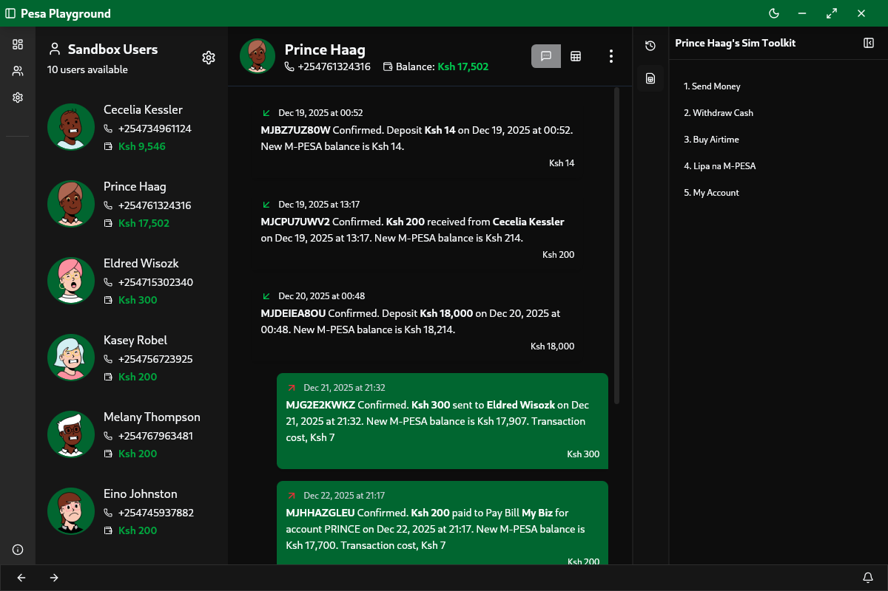
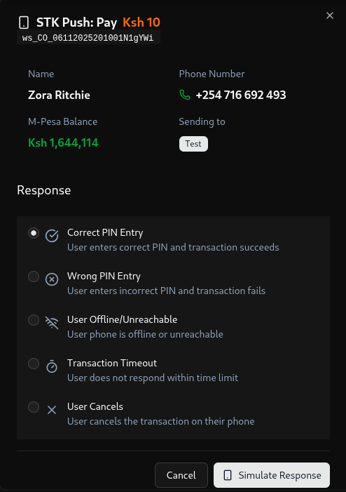
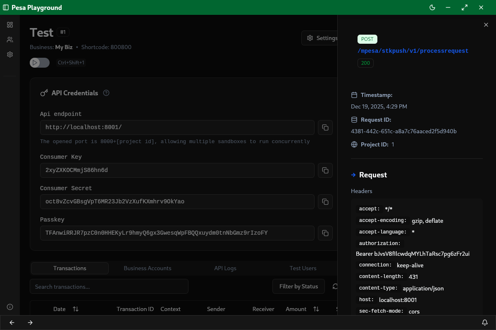
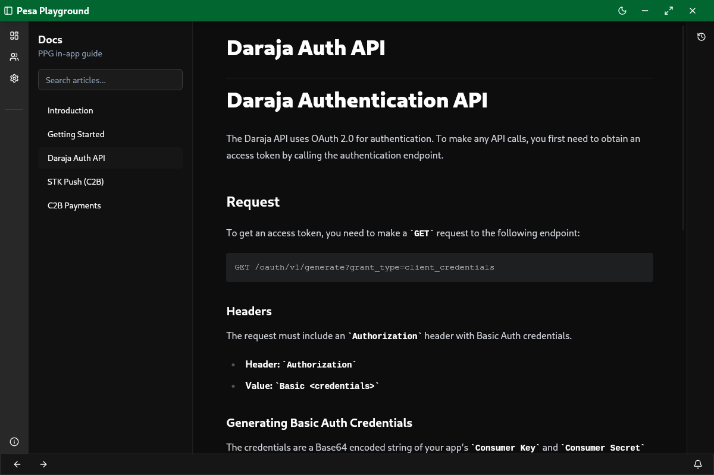

<h1 align="center">Pesa playground</h1>
<p align="center">
  <i>
  A local M-Pesa ecosystem simulator built for developers who need reliable, controllable test environments.
  </i><br />
  
  <br />
  <b>
    Code. Trigger. Respond. Repeat
  </b>
</p>

<p align="center">
    <a href="https://github.com/OmentaElvis/pesa-playground/actions/workflows/semantic-release.yml">
        
    </a>
    <a href="https://opensource.org/licenses/BSD-2-Clause">
        
    </a>
</p>
<p align="center">
    <a href="https://svelte.dev/">
      
    </a>
    <a href="https://tauri.app/">
      
    </a>
    <a href="https://rust-lang.org/learn/get-started/">
      
    </a>
</p>

## 🦎 Overview

**Pesa Playground** emulates the core behaviour of the M-Pesa platform - users, tills, paybills, wallet balances, and STK push flows - entirely locally on your machine.
It’s a lightweight desktop tauri app with a simple API layer for automation and integration testing.

The goal is to make development around M-Pesa integrations straightforward and predictable.
You run the app, point your backend to the local endpoints, and test complete payment flows end-to-end.


## ✨ Features
- **FOSS (Free and Open-Source Software)**
  Our sandbox is open-source, allowing you to inspect and modify the core code,
  understand how your requests are processed, and contribute to the project.
  This transparency makes it easier to spot bugs and collaborate with the community.
  It is also fully modular. The core is a standalone library, you can add any frontend to it. 

- **Complete Wallet Simulation**
  Create and manage users with phone numbers, balances, and transaction histories.
  <p align="center">
    
  </p>

- **Transfer and Payment Flows**
  Send money between users, tills, and paybills using familiar API patterns and inbuilt Sim Toolkit.
  Pesa playground uses a unified transaction ledger that allows emulation of MPesa transaction engine. So everything is designed to be interactible.
  Users can send money between each other, user to business and business to business. The system sees everything as an account that money can be transferred between.

- **Interactive STK Push**
  A visual prompt allows you to control how the simulated device responds.
  You can choose from various responses, including correct PIN, timeout, offline, or cancelled prompts.
  This feature enables you to test edge cases in a simulated environment, rather than in production.
  Additionally, you can see visual feedback for your STK push requests, providing transparency and eliminating the "black box" effect of identical automated replies.
  This is particularly useful for visually demonstrating the payment system of your app.
  <p align="center">
    
  </p>


- **Offline-First**
  Runs entirely locally - no external services, account logins or network tunnels.

- **Clear Logging**
  Every request and transaction is logged for easy debugging and traceability.
  We provide detailed explanations for API request failures. Our API pipeline utilizes
  the Rust Serde library to automatically validate your requests, providing specific and
  informative error messages instead of generic errors when your request body fails parsing.
  

- **Inbuilt docs**
  Everything in one place. We provide built-in documentation for various implemented API endpoints.
  Our goal is to create a comprehensive, community-sourced documentation hub that captures everything we've learned so far.
  

- **Chameleon**
  Did you know their eyes are independently mobile, providing a 180-degree field of vision 
  to monitor multiple directions at once? This unique stereoscopic perspective is 
  essential for their primary daily task: catching bugs for breakfast. While most 
  species rely on blending into their environment, the chameleon changes color to 
  reflect its internal state, making it much easier to spot what is happening 
  under the surface before things move to the wild.

## 🚀 Installation

### Building from Source

To build Pesa Playground from source, you'll need a <a href="https://rustup.rs/">Rust toolchain</a> and <a href="https://pnpm.io/installation">pnpm installed</a>.

1.  **Clone the repository:**

    ```bash
    git clone https://github.com/OmentaElvis/pesa-playground.git
    cd pesa-playground
    ```
2.  **Install pnpm dependencies:**

    ```bash
    pnpm install
    ```
3.  **Build the Tauri application:**

    ```bash
    pnpm tauri build
    ```
    The binaries will be located in `target/release/bundle/`.

### 🐋 Using Docker

A prebuilt Docker image is available on [GitHub Container Registry](https://github.com/OmentaElvis/pesa-playground/pkgs/container/pesa-playground).
Good for containerized workflow.

1.  **Pull the Docker image:**

    ```bash
    docker pull ghcr.io/omentaelvis/pesa-playground:latest
    ```

2.  **Run the Docker container:**

    ```bash
    docker run --init -it --rm -p 3001:3000 -p 8001:8001 ghcr.io/omentaelvis/pesa-playground:latest
    ```
    Note: Ports `800*` are dependent on the project ID. For example, project 1 will open port `8001`.

### Prebuilt Binaries

You can download prebuilt binaries directly from the [Releases page](https://github.com/OmentaElvis/pesa-playground/releases) on GitHub.

Available formats include:

-   AppImage (Linux)
-   .deb (Linux)
-   .rpm (Linux)
-   setup.exe (Windows)


## 📝 Feature To-Do List

Core M-Pesa API coverage roadmap for **Pesa Playground**.
> [!NOTE]
> Daraja 3.0 was released in November 2025, at which point most of the APIs had not yet been implemented.
> As far as I know, there is no easy way to access the old documentation, so it's safe to assume that this sandbox will implement Daraja 3.0.
> We will attempt to add backwards compatibility with previous versions later.

- ✅ **Authentication** - OAuth token generation and validation
- ✅ **STK Push (C2B Payment Simulation)** - full request/response flow with interactive prompt

#### Customer to Business (C2B)
- ✅ Register URL - simulate callback registration
- ✅ C2B Payment - simulate customer-initiated payment to paybill/till
- ✅ C2B Validation and Confirmation callbacks

#### Business to Customer (B2C)
This is a unified api that is used by Business To Pochi and Business To Customer (B2C)

- ✅ B2C Payment Request - simulate disbursements to mobile numbers
- [ ] Transaction Status query
- ✅ Balance query

#### Business to Business (B2B)
This is a unified api that is used by Tax remitance, Business Paybill, Business Buy Goods and B2C Account Top Up

- [ ] B2B Payment Request - simulate transfers between business accounts
- [ ] B2B Transaction Status query
- [ ] Balance query

#### Account Management & Queries
- [ ] Reversal Request - simulate transaction reversals
- [ ] Transaction Status - verify or track payment progress
- [ ] Balance Inquiry - return current wallet or till balance

#### Utility & Simulation
- ✅ Configurable failure modes (timeout, insufficient funds, declined)
- ✅ Adjustable latency simulation
- [ ] Sandbox-to-production parity testing mode
- [ ] Scripting (lua) - ongoing

#### User Interface
- ✅ Interactive transaction viewer
- ✅ Wallet editor (balances, user creation, history)
- ✅ STK push prompt (approve/decline/time-out)

## 🙏 Contributing

Contributions, feedback, and ideas are welcome.
Open an issue or PR to discuss improvements.
